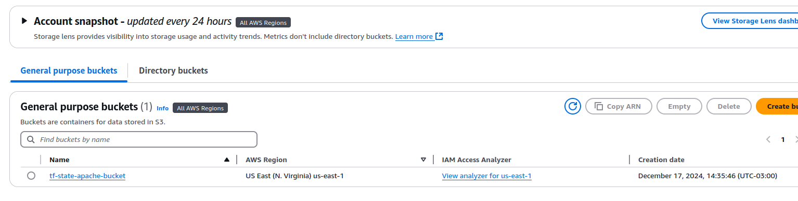

# devops-g6-pin2
EducacionMundose/PIN2

<span style="color: red;">MundosE</span> - <https://mundose.com/index.html>

## DiplomaturaenDevOps

### Edición 2403

# Informe Práctico Integrador N-2(PIN-2)
_“GHActions-apache–AWS”_

#### Tutor:

- Guazzardo,Marcelo

#### Grupo6:

- HectorBarrios hdbarrios@gmail.com
- JuanPabloHeyda juanpabloh.123@gmail.com
- RenzoCarletti renzocarletti@hotmail.com/pipito1498@gmail.com
- JohannaDominguez johisd9@hotmail.com
- LucasBufano lucas.bufano2@gmail.com

#### RepositoriodeGitHubPúblico:

- https://github.com/hdbarrios/devops-g6-pin

## Objetivos:

- Instalar terraform
- Configurar usuario programático en AWS IAM
- Desarrollar código terraform para crear una instancia EC2 aprovisionada con apache
- Utilizar github actions para desplegar un apache
    - Plus-destruir toda la infra desde github actions.

## Pre-Requisitos:

### Instalar terraform

<https://developer.hashicorp.com/terraform/tutorials/aws-get-started/install-cli>

```sh
$ sudo apt-get update && sudo apt-get install -y gnupg
software-properties-common

$ wget -O- https://apt.releases.hashicorp.com/gpg | \
gpg --dearmor | \
sudo tee /usr/share/keyrings/hashicorp-archive-keyring.gpg > /dev/null

$ gpg --no-default-keyring \
--keyring /usr/share/keyrings/hashicorp-archive-keyring.gpg \
--fingerprint

$ echo "deb [signed-by=/usr/share/keyrings/hashicorp-archive-keyring.gpg] \
https://apt.releases.hashicorp.com $(lsb_release -cs) main" | \
sudo tee /etc/apt/sources.list.d/hashicorp.list

$sudo apt update && sudo apt-get install terraform -y

$ terraform -version
Terraform v1.10.
on linux_amd
```

**Adicional puedes instalar** `tfenv` **para tener varias versiones de Terraform:**

<https://github.com/tfutils/tfenv>

```sh
$ export PATH="$HOME/.tfenv/bin:$PATH" #INCLUIR EN ~/.bash_profile
$ tfenv
tfenv 3.0.
Usage: tfenv <command> [<options>]

Commands:
install Install a specific version of Terraform
use Switch a version to use
uninstall Uninstall a specific version of Terraform
list List all installed versions

list-remote List all installable versions
version-name Print current version
init Update environment to use tfenv correctly.
pin Write the current active version to ./.terraform-version

$ tfenv use 1.10.
No installed versions of terraform matched '1.10.2:^1.10.2$'. Trying to
install a matching version since TFENV_AUTO_INSTALL=true
Installing Terraform v1.10.
Downloading release tarball from
https://releases.hashicorp.com/terraform/1.10.2/terraform_1.10.2_linux_amd
4.zip
###########################################################################
###########################################################################
################################# 100.0%
Downloading SHA hash file from
https://releases.hashicorp.com/terraform/1.10.2/terraform_1.10.2_SHA256SUMS
Not instructed to use Local PGP (/home/hbarrios/.tfenv/use-{gpgv,gnupg}) &
No keybase install found, skipping OpenPGP signature verification
Archive: /tmp/tfenv_download.Yfp59d/terraform_1.10.2_linux_amd64.zip
inflating: /home/hbarrios/.tfenv/versions/1.10.2/LICENSE.txt
inflating: /home/hbarrios/.tfenv/versions/1.10.2/terraform
Installation of terraform v1.10.2 successful. To make this your default
version, run 'tfenv use 1.10.2'
Switching default version to v1.10.
Default version (when not overridden by .terraform-version or
TFENV_TERRAFORM_VERSION) is now: 1.10.
```

### Crear el backend:

Usando **`create_backen.sh`** , si no tienes el archivo `~/.aws/config` creado, ejecutar:

`aws configure –profile terraform-admin` 
_(sea conseja si tienes más de una cuenta por
administrar usar profiles)_

<div style="text-align: center;">
  <a href="docs/imgs/Screenshotfrom2024-12-1809-26-16.png" target="_blank">
    
  </a>
  <a href="docs/imgs/Screenshotfrom2024-12-1714-36-18.png" target="_blank">
    
  </a>
  <a href="docs/imgs/Screenshotfrom2024-12-1714-36-49.png" target="_blank">
    
  </a>
  <a href="docs/imgs/Screenshotfrom2024-12-1715-13-20.png" target="_blank">
    
  </a>
  <a href="docs/imgs/Screenshotfrom2024-12-1715-16-18.png" target="_blank">
    
  </a>
  <a href="docs/imgs/Screenshotfrom2024-12-1715-17-37.png" target="_blank">
    
  </a>
</div>

### Evaluar código terraform y credenciales aws:

Lista de comandos de Terraform que puedes usar para probar y luego aplicar tu configuración en los archivos de Terraform:

#### 1.Inicializar Terraform

Primero, se debe inicializar el entorno de Terraform. Esto instalará los proveedores
necesariosyconfigurarátubackend(siloestásusando).

`terraform init -backend-config="profile=terraform-admin"`

Este comandose ejecuta una sola vez cuando configuras un nuevo proyecto Terraform o cuando haces cambios en los proveedores y módulos.

#### 2.Verificar la configuración (Planificación)

Para revisar qué cambios realizará Terraform en tu infraestructura, se puede ejecutar el comando terraform plan.Este comando no realizará ningún cambio, solo mostrará una descripción detallada delo que se va a hacer.

`terraform plan -var-file=profiles/pin2.tfvars -out=tfplan`
...

Para este proyecto se debe especificar el archivo de variables `pin2.tfvars` con la opción `-var-file` para que Terraform use las configuraciones definidas en ese archivo.

**Salida esperada**: Terraform mostrará un resumen de los recursos que se van a crear, modificar o destruir.

Nota:
- se puede ejecutar para validar sintaxis: `terraform validate`

Permite tener código desalida si sequiere implementar CI/CD:

`terraform plan -var-file=profiles/pin2.tfvars -out=tfplan
-detailed-exitcode && echo $?`

- **Códigodesalida 0** :No hay cambios
- **Códigodesalida 1** :Ocurrió un error
- **Códigodesalida 2** :Se detectaron cambios

Nota: _en github actions no es recomendable aplicar directamente ya que el workflow toma el codigo de salida 1 o 2 como error de ejecución._

#### 3.Aplicar la configuración (Ejecutar cambios)

Si todo estábien con el `tf-plan` y se puede aplicar los cambios,ejecuta:

`terraform apply -var-file=profiles/pin2.tfvars`

Terraform pedirá confirmación antes deproceder.Al estar seguro de que los cambios son correctos, se escribe `yes` para confirmar.

...

#### 4.Ver los resultados de la aplicación

Después deaplicar la configuración, Terraform mostrará la salida definida en tu archivo `outputs.tf`, si has configurado algún bloque output.

Para obtener información adicional sobre los recursos creados (por ejemplo,la dirección IP pública de una instancia EC2),se puede usar:

`terraform output -var-file=profiles/pin2.tfvar`

### 5.Comprobar elestado actual de Terraform

Si se requiere ver el estado actual de la infraestructura gestionada por Terraform, ejecutar:

`terraform show`

>Para tener una salida en yml del comando anterio
>Instalación:
>
>```sh
>$ export VERSION=v4.2.0 && export BINARY=yq_linux_amd64 && wget
>https://github.com/mikefarah/yq/releases/download/${VERSION}/$
>{BINARY}.tar.gz -O - | tar xz && sudo mv ${BINARY}
>/usr/bin/yq
>
>$ terraform show -json | jq. | yq eval -P
>```

#### 6.Destruir la infraestructura (opcional)

Si se necesita destruir todos los recursos que has creado (por ejemplo,para probarla limpieza), puedes usar:

`terraform destroy -var-file=profiles/pin2.tfvars`

Terraform solicitara confirmación. Escribe `yes` para proceder.


...

...


### GitHub Actions:

Se procede a configurar los secrets de acceso a la cuenta AWS, los nombres deben de coincidir luego en los workflows de las actions de github que se diseñaron.

[Settings > Secrets and variables > Actions > Repository secrets](https://github.com/hdbarrios/devops-g6-pin2/settings/secrets/actions)

[AWS_ACCESS_KEY_ID](https://github.com/hdbarrios/devops-g6-pin2/settings/secrets/actions/AWS_ACCESS_KEY_ID)

[AWS_SECRET_ACCESS_KEY](https://github.com/hdbarrios/devops-g6-pin2/settings/secrets/actions/AWS_SECRET_ACCESS_KEY)

**Los Workflows diseñados fueron:**

[TerraformApply](https://github.com/hdbarrios/devops-g6-pin2/actions/workflows/tf-apply.yml), solo se ejecuta encondiciones:

```yml
on:
  push:
    branches:
      - master
  pull_request:
    branches:
      - master
  workflow_dispatch:
    branches:
      - master
```

[TerraformDestroy](https://github.com/hdbarrios/devops-g6-pin2/actions/workflows/tf-destroy.yml), solo se ejecuta con la condicion;

```yml
on:
  workflow_dispatch:
    branches:
      - master
```

Ejemplo de ejecución con PR:


Si todo sale bien, se podrá observar la IP pública de la instancia y si la usamos para navegar en un browser podremos ver la ejecución del apache:

Si se ejecuta de nuevo el workflow `Terraform-Apply` indicará que no existen cambios por aplicar.


Estatus del Workflow sobre elcommit-merge:


Al finalizar se observa failed o successful dependiendo el estado del job,para elejemplo: “Sucessful”


El Workflow `Terraform-Destroy` solo se ejecutara ondeman:

...
